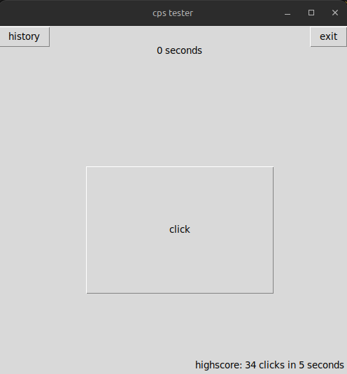
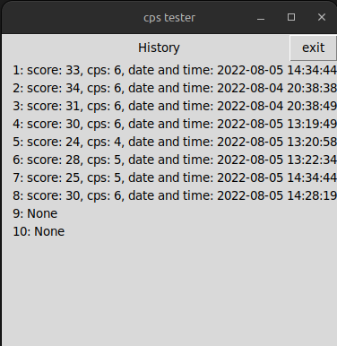

# CPS Tester

> Thanks [DALL-e](https://openai.com/dall-e-2/) for the logo.

CPS tester is a fun tool that tracks your CPS, clicks per second.

CPS tester has a history to see your past 10 runs.

## Prerequisites

- Tkinter
- sqlite3

## How to use

1. Run `python cps_tester.py`
2. Start testing your CPS by clicking the big click button in the middle of the score screen

3. The timer will start so start clicking the big button!
4. 

## Upcoming Updates

- settings window
- allow more runs to be viewed in history
